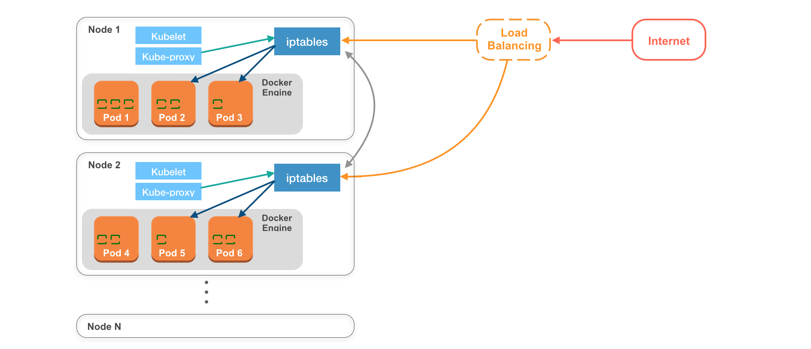

# NODE

-   一台機器(實體||虛擬),足以跑起 Pod 就可以算是
-   Node 都有屬於它自己的 iptables(防火牆)
-   kubelet 用於管理該 Node 上的所有 pods 以及與 master node 即時溝通
-   kube-proxy 則是會將目前該 Node 上所有 Pods 的資訊傳給 iptables
    -   Pod 物件被建立時，kube-proxy 會通知 iptables，以確保該 Pod 可以被 Kubernetes Cluster 中的其他物件存取
-   收到外部傳來的 requests 都會先交由 Load balancer 處理,再由 Load balancer 決定要將 request 給哪個 Node
    -   nginx
-
